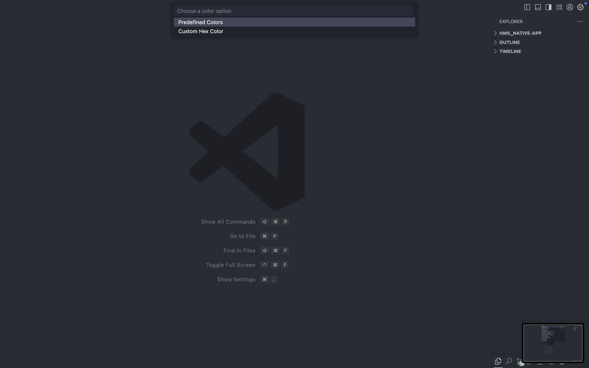
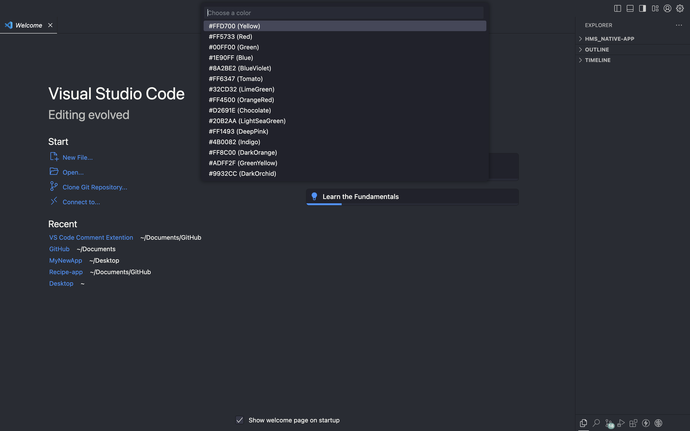
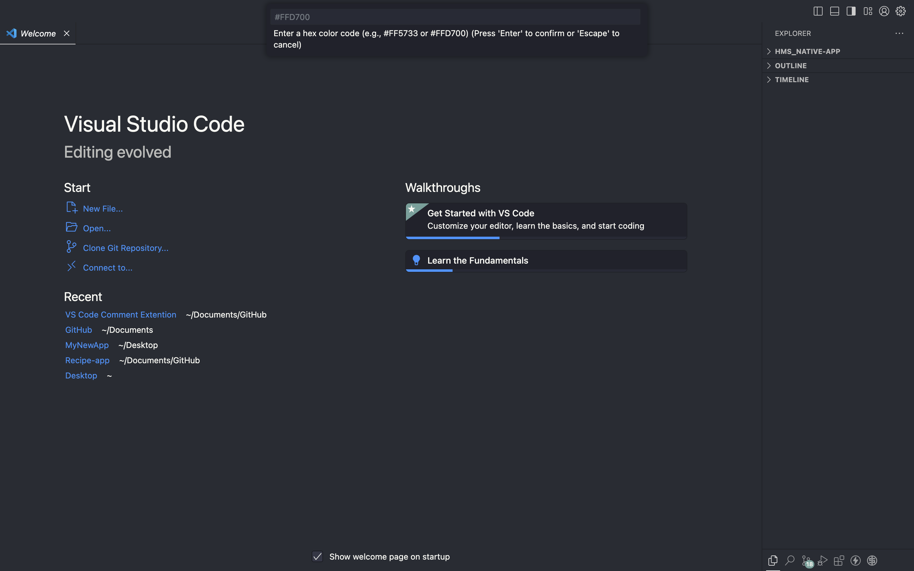

# VS Code Comment Extension

This extension allows you to customize the color of comments in Visual Studio Code with predefined or custom hex color options.

## Features
- **Automatic**: Yellow color is selected automatic.
- **Predefined Colors**: Choose from a list of predefined colors (e.g., yellow, red, blue, etc.).
- **Custom Color**: Enter a custom hex color code for your comments.
- Images demonstrate the use of these features.

## Usage

1. Open the command palette (`Ctrl+Shift+P` or `Cmd+Shift+P` on macOS).
2. Type `> Change Comment Color` and select the command.
3. Choose one of the following:
   - **Predefined Colors**: Select a predefined color.
   - **Custom Hex Color**: Enter your custom hex code (e.g., `#FFD700`).

Here are examples of how comments look with different color options:

### Custom Setup Screenshots

## Requirements

- Visual Studio Code version 1.75.0 or higher.

## Known Issues

- The extension modifies the global settings of VS Code. which a little slower.

## Release Notes

### 1.0.0

- Added features for predefined and custom color options for comments.
- Demonstrated functionality using screenshots.
